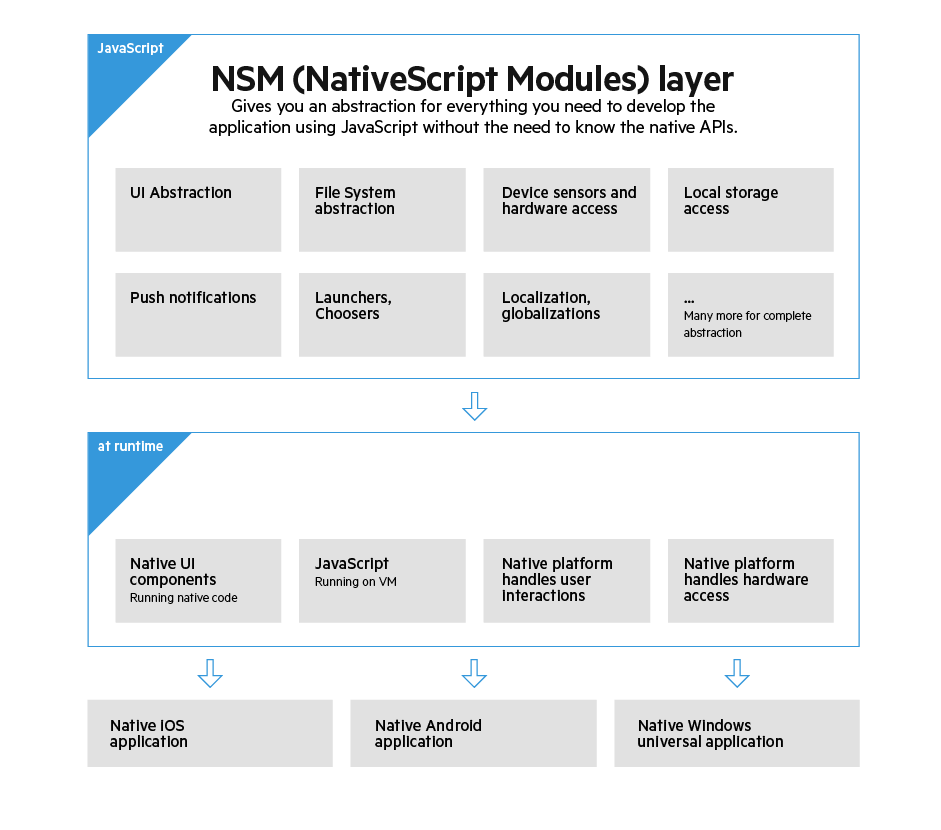
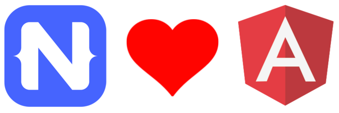
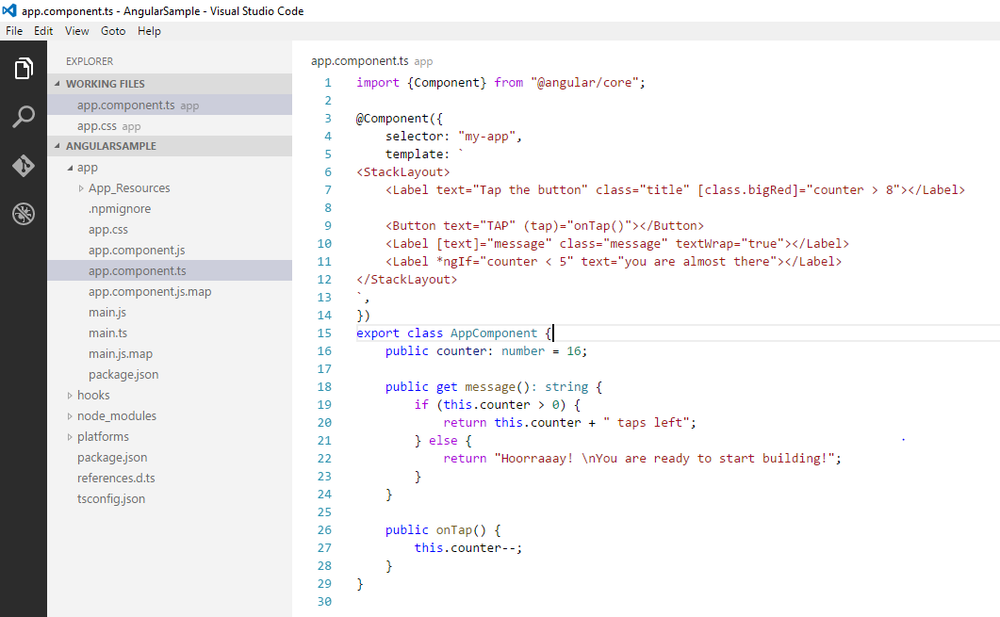
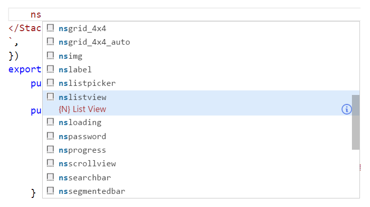

# Mobile Apps mit NativeScript und Angular 2 entwickeln
## Das Beste aus allen Welten

### Statt eigenständige, native Apps für die mobilen Betriebssysteme zu erstellen, können Sie auf hybride Apps auf Basis von HTML und JavaScript setzen. Dabei sind Beschränkungen schwer zu vermeiden. Das Open-Source Framework NativeScript schickt sich an, die letzten vorhandenen Grenzen einzureißen: echte native Apps auf Basis von JavaScript.

Die Anforderungen an moderne Apps sind unter anderem eine ansprechende Ästhetik, ein plattformspezifisches Nutzererlebnis und natürlich bestmögliche Performance. Normalerweise werden hierzu eigenständige Apps für die beiden großen mobilen Betriebssysteme erstellt. Doch parallele Entwicklungen erzeugen gleichzeitig erhöhte Kosten. Eine Antwort darauf sind hybride Apps auf Basis von HTML und JavaScript. Das bedeutet automatisch aber ein paar technische Beschränkungen. Durch NativeScript von Telerik (ein Unternehmen von Progress Software) ist es möglich, direkt mit JavaScript native Apps zu entwickeln. Diese Apps sind nicht mehr von Lösungen unterscheidbar, die klassisch auf Basis von Objective-C bzw. Swift oder Java entwickelt worden sind. Sie verfügen über eine beachtliche Geschwindigkeit und verwenden die normalen Bedienelemente des jeweiligen mobilen Betriebssystems.


> [Abb. 1] Zwei NativeScript-Screens unter iOS


#### Was ist NativeScript?

NativeScript ist ein Open-Source Framework zur Entwicklung von mobilen Apps [1]. Neben der Programmiersprache JavaScript wird auch die JavaScript-Obermenge TypeScript direkt unterstützt. Aktuell stehen als Zielplattform sowohl Android als auch iOS zur Verfügung. Seit der jüngsten Version 1.7 (März 2016) ist auch ein Support für universelle Windows-Plattform Apps (UWP) hinzugekommen. Jene universellen Apps sind auf Windows Phone 10 und Windows 10 ausführbar. Momentan wird die neueste Zielplattform aber noch als „proof of concept” eingestuft. Zum aktuellen Zeitpunkt sind nur NativeScript-Apps für Android und iOS reif für den produktiven Einsatz.

Auf den ersten flüchtigen Blick scheint das Framework eine weitere Variante des hybriden Ansatzes zu sein. Das bekannteste hybride Framework dürfte Apache Cordova (ehemals PhoneGap genannt) sein [2], das den Einsatz von HTML und JavaScript zur App-Entwicklung salonfähig gemacht hat. Cordova lässt Webanwendungen in einem Browser laufen und ermöglicht über Schnittstellen ebenso den Zugriff auf native Funktionen. Sofern Sie mit dem SPA-Framework AngularJS vertraut sind, steht Ihnen z.B. durch Einsatz des Ionic-Frameworks eine populäre und weit verbreitete Lösung zur Verfügung. Durch den Einsatz von vorbereiteten Themes und eigenem graphischen Geschick muten die fertigen Apps anschließend wie native Anwendungen an. Ein grundlegendes Problem ergibt sich jedoch prinzipiell immer: Eine hybride App ist und bleibt eine Website, die nur den Anschein erweckt, es handle sich um eine native Anwendung. 

Im Gegensatz dazu reiht sich NativeScript in eine neue Disziplin ein. In dieser Disziplin geht es darum, JavaScript als vollwertige Programmiersprache für Apps zu etablieren. Weitere Frameworks, die native Apps mit JavaScript ermöglichen, sind React Native von Facebook und Appcelerator Titanium. Bei allen drei Lösungen fällt der Umweg über HTML und das DOM schlicht weg. Die Frameworks ermöglichen die direkte Verwendung von nativen UI-Elementen aus der JavaScript-Umgebung heraus. Bei NativeScript für Android ist diese Umgebung Googles V8-Engine [3]. Unter iOS sowie unter Windows kommt JavaScriptCore zum Einsatz [4].


> [Abb. 2] Die verwendeten JavaScript Virtual Machines

##### Tipp: Sollten Sie skeptisch hinsichtlich der Performance sein, dann probieren Sie doch einfach die „Examples NativeScript” Apps im Google Play Store [5] oder iTunes [6] aus. Die App enthält eine Sammlung von graphischen Beispielen, welche die breiten Anwendungsmöglichkeiten von NativeScript demonstrieren.


#### Warum NativeScript?

Die technische Grundlage mag zwar spannend sein, doch im Projektalltag zählen praktische Gründe. Eine Reihe von Gegebenheiten spricht für den Einsatz von NativeScript.

__Wiederverwendung von bestehende Skills:__ Das Erlernen einer neuen Programmiersprache zum Zwecke der App-Entwicklung ist anstrengend und aufwändig. Der Erwerb von Grundlagen einer Programmiersprache ist dabei noch das kleinere Problem. Der eigentliche Aufwand liegt im Detail. Es ist ein mühsamer und intensiver Prozess, bis ein Neueinsteiger tatsächlich alle Aspekte einer Programmierwelt kennt und sicher beherrschen kann. Während dieser Einarbeitung steht der Programmierer natürlich nicht mehr mit dem gewohnten Potential und der üblichen Kapazität
zur Verfügung.

Wenn Sie hingegen schon einmal eine Anwendung für das Web entwickelt haben, so sind sie unweigerlich mit JavaScript, ggf. sogar mit TypeScript und auf jeden Fall mit CSS in Berührung gekommen. Damit steht Ihnen bereits ein großer Teil des notwendigen Wissens zur Verfügung. Das dedizierte Erlernen von Objective-C, Swift, Java und/oder C# entfällt. Sollten Sie sich zudem mit den neuesten Trends zur Webentwicklung beschäftigen, dann wird für Sie die Unterstützung von Angular 2.0 von großem Interesse sein. Auf diese spannende Allianz von NativeScript und AngularJS werden wir im zweiten Teil dieses Artikels noch intensiver eingehen.

**Wiederverwendung von bestehendem Code:** Durch den Einsatz der Programmiersprache JavaScript bietet es sich an, bestehende Geschäftslogik oder Bibliotheken aus dem Internet weiter zu verwenden. Mit dem Repository NPM steht ein großer Fundus aus kurzen Schnipseln bis ganzen Bibliotheken zur Auswahl. Es gilt lediglich zu beachten, dass in NativeScript kein DOM existiert. Das ist aber prinzipiell kein Problem, denn diese Restriktion gilt auch für alle üblichen Node.js-Pakete. Wenn Sie zum Beispiel ein Datum formatieren wollen, dann können Sie dafür die bekannte Bibliothek „moment” nutzen. Nach einer Installation per `npm install moment` steht Ihnen die Funktionalität wie üblich zu Verfügung:

```javascript
// JavaScript
var moment = require("moment");
var formattedTime = new moment().format("HH:mm:ss");
```
> Listing 1: Verwendung eines NPM-Pakets

Es ist weiterhin möglich, bestehende native Fremdbibliotheken für Android und iOS anzusprechen. Das bedeutet, dass Sie nicht in der JavaScript- bzw. NativeScript-Welt gefangen sind. Wenn es notwendig ist, können Sie auch sehr plattformspezifischen Code aufrufen. Von diesem Prinzip macht auch die KomponentenSammlung „UI for NativeScript” Gebrauch [7]. Die bestehenden Komponenten-Sammlungen sind hier vom Hersteller mit einem JavaScript-Wrapper vereinheitlicht worden. 

**Direkter Zugriff auf native APIs:** Manchmal werden Sie einfach nicht drum herum kommen und Sie müssen doch tief in das Betriebssystem abtauchen. Für diese Fälle bietet NativeScript den direkten Zugriff auf native APIs aus JavaScript heraus an. Das ist ein großer Vorteil gegenüber React Native und Appcelerator, wo dies nicht so einfach möglich ist. Diesen Aspekt werden wir gleich noch einmal näher beleuchten. 

**Open Source:** Die Gretchenfrage in Sachen Software lässt sich bei NativeScript ohne Bauchschmerzen beantworten. Ja, das Framework ist Open-Source. Es steht unter der „Apache License, Version 2.0” (ASLv2), welche die Kombination mit proprietärem Code erlaubt. Das NativeScript-Team selbst besteht aus rund 35 Köpfen. Das Team wiederum wird von einer aktiven Community unterstützt, die auf Github die Fortentwicklung über Bug-Reports und Pull-Requests antreibt [8]. Es ist problemlos möglich, einen kompletten NativeScript-Workflow mittels der „NativeScipt-CLI” aufzubauen [9]. Wenn Sie es jedoch etwas komfortabler wünschen oder kommerziellen Support benötigen, so gibt es von Progress entsprechende kostenpflichtige Angebote. Lizenzpflichtig sind ebenso die erweiterte Komponenten-Sammlung „UI for NativeScript Pro” und die integrierte Entwicklungsumgebung „Telerik Plattform”.

##### Hinweis: Das Unternehmen Telerik wurde Ende 2014 vollständig von Progress Software akquiriert. Schrittweise werden nun die Telerik-Produkte unter dem neuen Namen „Progress“ fortgeführt. Dies wird ggf. auch in Zukunft Einfluss auf die Namen der NPM-Pakete haben.


#### Hinter den Kulissen

Wie ist es möglich, unter Verwendung einer einzigen Code-Basis mehrere Plattformen anzusprechen? Die Grundlage hierfür bietet das NPM-Paket „**T**elerik **N**ativeScript **C**ore Modules” (kurz: „tns-core-modules”). Die darin enthaltenen Module bilden eine Abstraktionsschicht, die spezifische Implantierungen für die unterstützten Plattformen enthalten. Hier finden sich Module für die unterschiedlichen Aspekte der mobilen Entwicklung, von UI-Abstraktion zu Gerätesensoren bis hin zum Hardware-Zugriff (siehe Abbildung 3). 



> [Abb. 3] Die Abstraktionsschicht in einer Übersicht

Da die NativeScript-Module in TypeScript geschrieben sind, bieten kompatible Entwicklungsumgebungen dank der Typ-Definition eine komfortable automatische Code-Vervollständigung und Syntax-Prüfungen an. Eigene Module können Sie im selben Stil erstellen und das Software-Ökosystem erweitern (siehe [10]).

**UI-Abstraktion:** Die Gestaltung von Oberflächen wird natürlich nicht durch eine Aneinanderreihung von JavaScript-Befehlen realisiert. Stattdessen definieren Sie die Oberfläche in einem spezifischen XML-Dialekt. Tags wie `Button`, `TextField`, `DatePicker` werden hierbei in die jeweiligen Oberflächenelemente umgewandelt:

```xml
<!-- XML -->
<Page>
  <StackLayout>
    <Label text="Name"></Label>
    <TextField text="{{nameAttribute}}"></TextField>
    <Button text="Press Me" tap="doSomething"></Button>
  </StackLayout>
</Page>
```
> Listing 2: Eine einfache Seite mit Text und Button

Beim Build der Anwendung wird jeder Tag durch das jeweilige native Äquivalent ersetzt. So wird etwa aus dem „TextField” je nach Plattform `android.widget.EditText` (bei Android) bzw. `UITextField` (bei iOS).


#### Plattformspezifischer Code

Es gibt Situationen, in denen der Aufruf von plattformspezifischem Code notwendig wird. Das kann zum Beispiel der Fall sein, wenn eine Funktionalität tatsächlich nur auf der jeweiligen Plattform existiert, wenn eine native Fremdbibliothek eingebunden werden soll oder das gewünschte Feature tatsächlich einfach noch nicht über ein Core-Modul implementiert wurde. Hier kommt der Zugriff auf die „Native API” ins Spiel. Die native Welt kann dabei so aufgerufen werden, als ob es sich um normale JavaScript-Methoden handeln würde.

Als Beispiel soll das Datum der letzten Modifikation einer Datei ermittelt werden. Diese Funktionalität wird für Android und iOS gänzlich anders umgesetzt (siehe **Listing 3 und 4**).

```javascript
// JavaScript
var fileManager = NSFileManager.defaultManager();
var attributes = fileManager.attributesOfItemAtPathError(path);
var lastModifiedDate = attributes.objectForKey(this.keyModificationTime);
```
> Listing 3: Zugriff auf das Datum der letzten Modifikation unter iOS


```javascript
// JavaScript
var javaFile = new java.io.File(path);
var lastModifiedDate = new Date(javaFile.lastModified());
```
> Listing 4: Zugriff auf das Datum der letzten Modifikation unter Android

Das Beste an der gezeigten Syntax ist die Tatsache, dass sowohl Namespaces als auch Attribute und Typen sowie die gesamten Konventionen bei der Benennung dem Pendant aus der Android-bzw. iOS-Dokumentation entsprechen. Dasselbe gilt für Fremd-bibliotheken. So bringen Sie mit geringem Aufwand ein Code-Fragment aus den Dokumentationen oder dem Netz per Copy-and-Paste zum Laufen. Hinter den Kulissen verwendet NativeScript „Reflection”, um eine Liste von APIs aufzubauen, die auf der aktuellen Plattform zur Verfügung stehen und zum globalen Gültigkeitsbereich hinzugefügt werden. Die Details zu der verwendeten Technik können sie in einem detailierten Artikel nachvollziehen [11].


#### Styling

Bei der Gestaltung von Webseiten trennt man Struktur (HTML) und Design (CSS). Das direkte Styling von Elementen würde viel zu unübersichtlich sein und zu redundanten Deklarationen führen. Ganz ähnlich verhält es sich bei der Gestaltung einer NativeScript-App. Das Framework folgt hierbei den Spezifikationen von CSS und verwendet die bekannte Syntax, das Prinzip der kaskadierten Regeln und eine Auswahl an Selektoren und Deklarationen.

Mittels CSS lassen sich einfache Dinge wie Hintergrundfarbe und Schriftgröße bis hin zu komplexen Animationen realisieren (siehe **Listing 5 und 6**).

```css
/* CSS */
.small-label {
  font-size: 20;
  color: #284848;
  horizontal-align: center;
}
```
> Listing 5: Anpassung von Hintergrundfarbe und Schriftgröße per CSS

```css
/* CSS */
.button1:highlighted {
  animation-duration: 1s;
  animation-name: test;
}

@keyframes test {
  from { transform: none; }
  20% { transform: rotate(45); }
  50% { transform: rotate(50) scale(1.2, 1.2) translate(50, 0); }
  100% { transform: rotate(0) scale(1.5, 1.5) translate(100, 0); }
}
```
> Listing 6: Einen Button per CSS animieren

Das Styling per CSS ist bei NativeScript im Vergleich zum Browser jedoch sehr limitiert. Es handelt sich hierbei um eine übersichtliche Teilmenge des bekannten Browser-CSS. Dies liegt nicht zuletzt auch darin begründet, dass die verfügbaren Eigenschaften dem gemeinsamen Nenner der drei verfügbaren Plattformen entsprechen müssen.


#### Angular 2


> [Abb. 4] NativeScript loves Angular

In den letzten Jahre haben mehr als eine Million Entwickler erfolgreich mit AngularJS Single-Page-Anwendungen erstellt. Angular ist damit das populärste Framework um client-seitige Webanwendungen zu entwickeln. Allerdings blieb das Framework dabei bislang immer auf das Web beschränkt. Das bedeutet, dass man bis dato völlig andere Tools, Programmiersprachen und Frameworks benötigte, um Anwendungen für den Desktop oder für mobile Geräte an den Start zu bringen. Die Version 2 von AngularJS wurde hingegen als komplette Neuentwicklung konzipiert. Dieser komplette Rewrite wurde stark auf Plattformunabhängigkeit ausgerichtet. Das bedeutet, dass das Framework so entworfen wurde, dass diverse Plattformen angesprochen werden können - sei es Web, Mobil, Desktop und sogar IoT-Geräte [12]. 

NativeScript wurde als reines JavaScript-Framework geschaffen, das User-Interfaces per XML definiert und mit CSS formatiert. Beide Frameworks haben in der Kombination ein großes Potential. Das wurde recht schnell auch von  Google und Progress erkannt. Seit Mitte 2015 arbeiten daher das Angular-Team und das NativeScript-Team zusammen um beide Frameworks miteinander zu verbinden. Dabei ist es eine gute Fügung, dass beide Projekte auf TypeScript setzen. Das Ergebnis der Zusammenarbeit beider Teams ist die "Angular 2 Rendering Architecture" [13], welche stark durch NativeScript 2 geprägt ist. Vereinfacht ausgedrückt ist die Angular-2-Architektur hierbei in zwei Teile aufgeteilt:

- __Plattform-unabhängiger Teil__: hier wir das Markup (HTML) durch einen DOM-Adapter geparst und in so genannte „Proto Views“ compiliert. Dieser Prozess ist nicht spezifisch für eine Zielplattform und die meisten Funktionen können in den verschiedenen Plattformen genutzt werden
- __Plattform-spezifischer Teil__: hier geschieht die Magie. Es werden plattformspezifische Renderer verwendet, um die unterschiedlichen Zielplattformen abzubilden. Jene Renderer haben die Aufgabe, aus den „Proto Views“ einen „Visual Tree“ zu generieren. Dieser kann dann verwendet werden, um die Oberfläche anzuzeigen. Der Renderer ist ebenso dafür verantwortlich, Änderungen und Events zwischen „Proto Views“ und „Visual Tree“ auszutauschen.


> [Abb. 5] Die Rendering-Architektur von Angular 2

Durch diese durchdachte Architektur ist es möglich, neue Ziele zu definieren. Es müssen nur die notwendigen Erweiterungen implementiert werden. Hier wird es aus architektonischer Sicht interessant.


#### Angular 2 als Native App

Auf Grundlage der plattformunabhängigen Architektur kann NativeScript sich nahtlos integrieren. Die Lösung   besteht darin, dass das bereits bekannte NativeScript-Markup in HTML-Dokumenten definiert wird und der "Dom Adaper" sowie der "Renderer" ausgetauscht werden. Das NativeScript-Markup profiert dabei von der prägnanten Template-Syntax von Angular 2. Jenes Markup kann dann vom DOM-Adapter „Parse5“ geparst werden. Den größten Anteil an der Umsetzung nimmt der „NativeScript Renderer“ ein. Dieser garantiert nicht zuletzt den Austausch zwischen „Proto Views“ und  den nativen UI Komponenten der jeweiligen Platform:


> [Abb. 6] Die Rendering-Architektur von Angular 2 mit NativeScript

Wenn man erstmal die neue Template-Syntax von Angular 2 gelernt hat, dann kann man das Wissen auf eine NativeScript-App übertragen. Es wäre natürlich möglich direkt mit purem JavaScript eine NativeScript-App zu entwickeln. Allerdings gewöhnt man sich schnell an den Komfort von Angular 2. Technische Aspekte wie "Dependency Injection" und "Change Detection" sind sehr einfach und verständlich in Angular 2 umgesetzt.   


#### Eine Beispiel-Anwendung

Als kleines Beispiel setzen wir einen Login-Screen mit Angular 2 und NativeScript 2 um. Sollten Sie noch nie mit Angular 2 in Berührung gekommen sein, verschafft Ihnen der offizielle „5-Minuten-Schnellstart” einen guten Überblick [14]. Zunächst benötigen wir eine Klasse mit dem Namen `UserService`, welche die Logik für die Anmeldung beinhaltet und die Zugangsdaten zum Backend senden soll (**Listing 7**).

```typescript
// TypeScript
import {Injectable} from "@angular/core";

@Injectable()
export class UserService {
  login(userName: String, password: String) {
    return doSomeMagicHereAndReturnPromise();
  }
}
```
> Listing 7: Der UserService kapselt die eigentliche Login-Funktionalität


Die wichtigsten Grundbausteine in Angular 2 sind Komponenten. Komponenten definieren ganze Seiten, einzelne UI-Elemente und Routen. Eine Komponente hat immer ein Template, das aber im Falle von NativeScript kein normales HTML beinhaltet. Angular 2 sorgt auch gleich noch per „Dependendy-Injection” (DI) für die Verdrahtung von UserService und Komponente, so dass wir uns um die Initialisierung des UserService nicht zu kümmern brauchen (**Listing 8**). 

```typescript
// TypeScript
import {UserService} from "./user.service";
@Component({
  selector: "my-app",
  providers: [UserService],
  templateUrl: "pages/login/login.html"
})
export class LoginPage {
  userName: String;
  password: String;

  constructor(private _userService: UserService) {
    this.username = "user@example.org";
    this.password = "password";
  }

  login() {
    this._userService.login(this.username, this.password)
      .subscribe(
        () => doSomethingOnSuccessfulLogin (),
        (error) => alert("Unfortunately we could not find your account.")
      );
  }
}
```
> Listing 8: Die Komponente LoginPage verknüpft die Geschäftslogik mit dem UI


Die Komponente `LoginPage` agiert als Bindeglied zwischen UserService und dem Template. Auf die Methode `login` sowie auf die beiden Eigenschaften „username” und „passwort” können wir nun im Template zugreifen.

Zum Schluss müssen wir nur noch einen Screen im Template definieren (**Listing 9**). Der bereits vorgestellte XML-Dialekt zur Definition der Oberfläche kommt auch hier zum Einsatz. Die [eckigen] und (runden) Klammern sind der Template-Syntax von Angular 2 geschuldet. Es handelt sich um so genannte „Bindings”, die als Verknüpfung mit der Komponente dienen. Da die Verwendung dieser Klammern kein valides XML ergeben würde, deklarieren wir das Markup lieber als HTML statt als XML. Ob es sich nun um HTML oder XML handelt, praktisch gesehen ergibt sich hieraus aber kein wirklicher Unterschied. Die Bindings hauchen der Oberfläche Leben ein. Wird in dem Textfeld die Eingabe geändert, so wird die Änderung sofort in der Komponente publik gemacht. Eine Betätigung des Buttons ruft anschließend die Login-Methode auf.

```html
<!-- HTML -->
<StackLayout>
  <Image src="res://logo_login" stretch="none" horizontalAlignment="center"></Image>
  <TextField hint="Email" [(ngModel)]="username"></TextField>
  <TextField hint="Password" secure="true" [(ngModel)]="password"></TextField>
  <Button [text]="Sign up" (tap)="login()"></Button>
  <Button [text]="Back to login"></Button>
</StackLayout>
```
> Listing 9: Das Template der Komponente LoginPage

Nun stellt sich die Frage, an welcher Stelle die Unterscheidung zwischen einer "normalen" Web-Anwendung und einer nativen Anwendung geschieht. Die Antwort lautet: beim "Boostrapping". Eine normale Angular 2 Anwendung startet mit der üblichen `bootstrap` Methode durch (Listing 10). Um die native Welt zu betreten, müssen wir hingegen die spezielle Methode `nativeScriptBootstrap` verwenden (Listing 11).

```typescript
// TypeScript
import { bootstrap } from '@angular/platform-browser-dynamic';
import { AppComponent } from './app/';
bootstrap(AppComponent);
```
> Listing 10: Das normale Bootstrapping

```typescript
// TypeScript
import { nativeScriptBootstrap } from "nativescript-angular/application";
import { AppComponent } from './app/';
nativeScriptBootstrap(AppComponent);
```
> Listing 11: Das Bootstrapping mit NativeScript
   

Et voilà! Schon steht die erste Seite unserer Anwendung. Zusammen mit etwas zusätzlichem Styling ergibt sich ein fertiger Dialog (siehe **Abbildung 7**). Das hier gezeigte Beispiel ist übrigens ein angepasster Ausschnitt aus der offiziellen Demo-App „Groceries”, mit der Sie eine Einkaufsliste zusammenstellen und teilen können. Die App kann einmal mit purem NativeScript [15] und einmal in Kombination mit Angular 2 [16] nachprogrammiert werden. Hier wird auch die Installation der notwendigen Abhängigkeiten – vor allem das iOS SDK und das Android SDK – detailliert beschrieben.


> [Abb. 7] Die finale Login-Seite unter Android und iOS


### Editoren

Als Leser der dotnetpro werden Sie sicher eine IDE von Microsoft im Einsatz haben. Wie schaut es daher mit der Unterstützung für NativeScript aus?

####  1. Visual Studio


> [Abb. 8] Installation des Telerik AppBuilder

Ab Visual Studio 2013 kann man per Extension die Unterstützung von NativeScript aktivieren. Installiert werden muss lediglich die **"AppBuilder Extension for Visual Studio"**. Hierbei benötigt man allerdings eine Account bei der kostenpflichtigen Lösung "Telerik Platform". Die Telerik Platform ist das Flagschiff von Progress, wenn es um die Entwicklung von mobilen Apps geht. Einer der Services ist z.B. das Kompilieren in der Cloud, was ziemlich praktisch ist, wenn man keinen Mac zur Verfügung hat.


> [Abb. 9] HelloWorld mit NativeScript

####  2. Visual Studio Code


> [Abb. 10] Visual Studio Code mit NativeScript

Der kleine Bruder von Visual Studio ist komplett Open-Source. Genau so verhält es sich mit der NativeScript Extension für Visul Studio Code. Man muss lediglich "F1" drücken und mit `ext install` nach "NativeScript" suchen. Während die Lösung von Visual Studio auf dem "AppBuilder" basiert, ist die Grundlage für Visual Studio Code die NativeScript-CLI [9]. Diese muss als globales NPM-Paket installiert sein. Zusätzlich sollte man genügend Zeit für das Setup einplanen, denn das benötigte Android SDK von Google ist nicht gerade leichtgewichtig. Die komplette Installation haben wir für Sie in einem separaten Blogpost beschrieben [17]. Naturgemäß kann man unter Windows keine iOS Apps kompilieren. Allerdings ist Visual Studio Code auch auf OS X zuhause. Wer einen Mac sein Eigen nennt, der kann sowohl Android- als auch iOS-Anwendungen auf seinem Rechner bauen. Hier wird dann zusätzlich XCode benötigt, die vollständige Installations-Einleitung finden Sie unter Link [18].    


> [Abb. 11] NativeScript Angular 2 code snippets

Sie sollten übrigens unbedingt die "NativeScript + Angular 2 Snippets" ausprobieren. Die Ersparen Ihnen eine gehörige Menge an Tipparbeit. 


### Fazit

Der Einstieg in die App-Entwicklung mit NativeScript ist für einen Webentwickler nicht sonderlich schwer. Angular 2 gibt der Anwendung eine solide Architektur vor und sorgt dafür, dass Geschäftslogik und Oberflächenelemente sauber getrennt bleiben. NativeScript wiederum liefert die Mechanismen, um mit nativen APIs und nativen UI-Elementen zu interagieren. Sie erhalten das Beste aus allen Welten: JavaScript bzw. TypeScript als Programmiersprache, Angular 2 als Oberflächenframework und das native Look-and-Feel, das schlussendlich dem Anwender gefallen wird.

<hr>


# Auf einen Blick


**Johannes Hoppe** ist selbstständiger IT-Berater, Softwareentwickler und Trainer für .NET und AngularJS. 2015 wurde er von Progress als "Telerik Developer Expert" ausgezeichnet. Er ist Leiter der .NET User Group Rhein-Neckar und unterrichtet als Lehrbeauftragter der DHBW Mosbach. Johannes schreibt über seine Trainings und Vorträge in seinem Blog (http://blog.johanneshoppe.de/). Demnächst wird sein Buch zu Angular 2 beim dpunkt.verlag erscheinen.


**Sebastian Witalec** ist Technical Evangelist bei Progress und hat über acht Jahre Erfahrung in der Softwareentwicklung. Sein Fokus liegt seit einigen Jahren auf der Cross-Plattform-Mobile-Entwicklung. Dadurch lernte er Apache Cordova und NativeScript kennen. Er lebt in London und arbeitet dort eng mit verschiedenen Entwicklercommunitys zusammen.


<hr>

#### Links

[1] NativeScript: https://www.nativescript.org/
[2] Apache Cordova: https://cordova.apache.org/
[3] Google V8: https://developers.google.com/v8/
[4] JavaScriptCore: http://trac.webkit.org/wiki/JavaScriptCore
[5] Examples NativeScript, Goolge Play: https://play.google.com/store/apps/details?id=org.nativescript.nativescriptmarketplacedemo
[6] Examples NativeScript, iTunes: https://itunes.apple.com/us/app/examples-nativescript/id1046772499?mt=8
[7] NativeScript Telerik UI: https://www.npmjs.com/package/nativescript-telerik-ui
[8] NativeScript auf Github: https://github.com/NativeScript/NativeScript
[9] NativeScript CLI auf NPM: https://www.npmjs.com/package/nativescript
[10] Building Your Own NativeScript Modules for npm: http://developer.telerik.com/featured/building-your-own-nativescript-modules-for-npm/
[11] How NativeScript Works: http://developer.telerik.com/featured/nativescript-works/
[12] Building Simon with Angular2-IoT: https://medium.com/@urish/building-simon-with-angular2-iot-fceb78bb18e5#.rfk659fc9
[13] Angular 2 Rendering Architecture: https://docs.google.com/document/d/1M9FmT05Q6qpsjgvH1XvCm840yn2eWEg0PMskSQz7k4E/edit
[14] Angular 2 - 5 Min Quickstart: https://angular.io/docs/ts/latest/quickstart.html
[15] NativeScript Getting Started Guide: http://docs.nativescript.org/tutorial/chapter-0
[16] Building Apps with NativeScript and Angular 2: http://docs.nativescript.org/angular/tutorial/ng-chapter-0.html
[17] Johannes Hoppe - Setting Up Android Emulators for NativeScript Development: http://blog.johanneshoppe.de/2016/06/setting-up-android-emulators-for-nativescript-development/
[18] NativeScript - Set Up Your System: http://docs.nativescript.org/angular/start/quick-setup